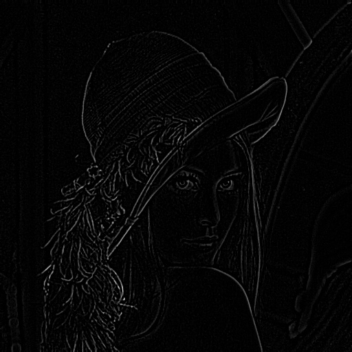
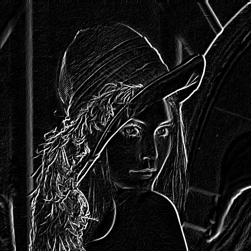
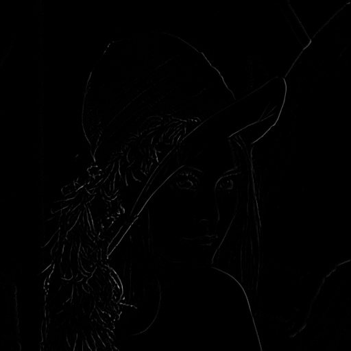
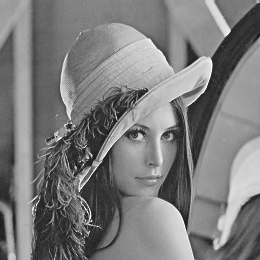

# Image Sharpening — 從零實作影像銳化演算法

本專案為 `image-process` 系列中的「影像銳化」。
目標是使用 **純 Python + NumPy** 手寫卷積運算（Convolution），實現類似 **Unsharp Masking** 的高階銳化流程。

透過本專案，你可以清楚看到「傳統 Laplacian 銳化」與「基於梯度遮罩（Gradient-Masked）銳化」的差異與數學原理。

---

## 專案特色

* **全手刻核心演算法**：不依賴 OpenCV 的 `filter2D` 或 `copyMakeBorder`，完全手寫 `CNN()` 卷積函式與 `add_border()` 鏡像填充。
* **兩種做法比較**：
    * **作法 A (Step 1-2)**：傳統銳化，直接疊加邊緣，容易放大雜訊。
    * **作法 B (Step 3-6)**：改良版銳化，引入 Sobel 梯度作為遮罩，只在強邊緣處銳化。
* **完整流程輸出**：程式輸出 `step1.jpg`～`step6.jpg`，將數學公式視覺化。

---

## 六大步驟流程

此流程分為兩部分：**傳統方法** (Step 1-2) 與 **改良方法** (Step 3-6)。

### 1. 提取邊緣特徵 (Laplacian)
先對影像做 Mean Filter 降噪，再進行 Laplacian 運算提取二階微分邊緣。
* **輸出**：`step1.jpg` (Laplacian 邊緣圖)

### 2. 傳統銳化 (Base Line)
將 Step 1 的邊緣直接加回原圖。這是最基礎的銳化，但會同時增強背景雜訊。
* **輸出**：`step2.jpg` (傳統銳化結果)

### 3. 計算梯度幅值 (Sobel Magnitude)
計算水平與垂直的 Sobel 梯度，合成梯度幅值 $(G_x^2 + G_y^2)^{1/2}$ ，找出影像中變化劇烈的區域。
* **輸出**：`step3.jpg` (梯度強度圖)

### 4. 製作平滑遮罩
對 Step 3 的梯度圖進行 Mean Filter 平滑化，使其成為一張穩定的權重分佈圖 (Mask)。
* **輸出**：`step4.jpg` (平滑後的梯度遮罩)

### 5. 邊緣加權 (Masking)
將 Step 4 的遮罩正規化 (0~1)，並乘上 Step 1 的 Laplacian 邊緣。
* **目的**：只保留「梯度強（真正的邊緣）」區域的 Laplacian 值，壓抑「梯度弱（雜訊）」區域的值。
* **輸出**：`step5.jpg` (過濾後的乾淨邊緣)

### 6. 最終銳化 (Final Result)
將 Step 5 過濾後的邊緣加回原始影像。
* **結果**：邊緣清晰銳利，但平坦區域（天空、皮膚）依然保持乾淨，無雜訊顆粒。
* **輸出**：`step6.jpg` (改良版銳化結果)

---

## 為什麼這樣做？

* **手寫 `CNN` 與 `add_border`**：理解卷積神經網路最底層的滑動視窗（Sliding Window）與邊界處理（Padding）機制。
* **Sobel vs Laplacian**：Laplacian 對雜訊極度敏感；Sobel 雖然模糊但能有效指出「哪裡是邊緣」。本演算法結合兩者優點：用 Sobel 告訴我們「在哪裡銳化」，用 Laplacian 告訴我們「銳化多少」。
* **正規化 (Normalization)**：將數值控制在 [0, 1] 之間作為權重，避免像素值溢出。

---

## 範例結果圖片

| Step | 說明 | 輸出檔案 | 圖片預覽 |
|:---:|:---|:---:|:---|
| **1** | **Laplacian 邊緣圖**<br>(含 Mean Filter 前處理) | `step1.jpg` |  |
| **2** | **傳統銳化結果**<br>(原圖 + Step1，雜訊較多) | `step2.jpg` |  |
| **3** | **Sobel 梯度幅值**<br>(偵測強邊緣位置) | `step3.jpg` |  |
| **4** | **平滑梯度遮罩**<br>(Mean Filter 後的 Mask) | `step4.jpg` |  |
| **5** | **加權後的邊緣**<br>(Step1 × Step4，去除雜訊邊緣) | `step5.jpg` |  |
| **6** | **最終銳化結果**<br>(原圖 + Step5，乾淨銳利) | `step6.jpg` |  |


---

## 使用方式

1. 準備灰階影像（如 `lena_black.jpg`）放於 `Image Sharpening/`。
2. 執行：

   ```bash
   python main.py
   ```
3. 產生輸出影像：

   ```
   step1.jpg ~ step6.jpg
   ```
4. 每張圖對應到前述的處理階段，可逐步檢視變化。
