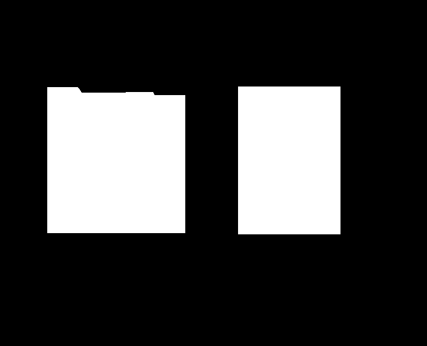
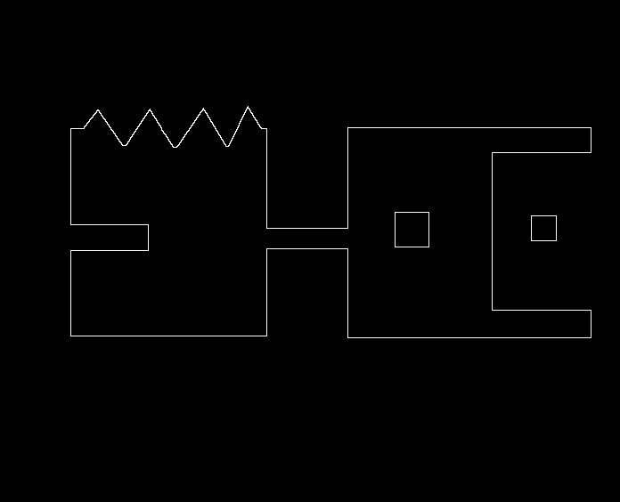

# Edge Detection — 形態學邊緣偵測與填補示例

本資料夾示範如何以 **形態學運算 (Mathematical Morphology)** 進行影像處理。  
程式碼 `main.py` 透過實作 **Erosion（侵蝕）** 與 **Dilation（擴張）** 兩項基本操作，進一步實現「**邊界擷取**」、「**Opening**」、「**Closing**」以及「**區域填補**」等多種應用。  

範例影像使用 **`test.png`** 進行處理。形態學操作皆以 **20 次**迭代為基準。

---

## 形態學基礎操作與複合運算

形態學操作基於**結構元素 (Structuring Element, SE)** 在二值影像上進行運算。

### 1) Erosion（侵蝕）

* **概念**：SE 完全覆蓋的前景區域才保留，否則中心像素變為背景（0）。
* **效果**：前景收縮、孔洞變大；邊界向內縮。
* **結果檔案**：`erosion.png` (經過 **20 次**迭代)。

### 2) Dilation（擴張）

* **概念**：只要 SE 與前景有任一像素重疊，中心像素就變為前景（1）。
* **效果**：前景膨脹、細縫被填補；邊界向外擴張。
* **結果檔案**：`dilation.png` (經過 **20 次**迭代)。

### 3) Opening（開運算）
    
* **定義**：先侵蝕 (Erosion) 再擴張 (Dilation)：`Open(A) = Dilate(Erode(A))`
* **效果**：平滑輪廓、去除前景中的尖銳突起（橋接）。
* **結果檔案**：`open.png` (Erosion 與 Dilation 皆經過 **20 次**迭代)。

### 4) Closing（閉運算）

* **定義**：先擴張 (Dilation) 再侵蝕 (Erosion)：`Close(A) = Erode(Dilate(A))`。
* **效果**：平滑輪廓、填補小的孔洞或狹窄的斷裂處。
* **結果檔案**：`close.png` (Dilation 與 Erosion 皆經過 **20 次**迭代)。

---

## 視覺化比較圖 (20 次迭代)

下圖展示了原始影像 (`test.png`) 與經過 **20 次**形態學操作後的結果比較：

| 原始影像 (`test.png`) | Erosion (`erosion.png`) | Dilation (`dilation.png`) |
| :---: | :---: | :---: |
|  |  |  |

| 原始影像 (`test.png`) | Opening (`open.png`) | Closing (`close.png`) |
| :---: | :---: | :---: |
|  |  |  |

#### 先 Opening 再 Closing 複合運算 (`open_after_close.png`)
此操作能夠有效平滑物體輪廓，去除小突起和填補小孔洞，同時保留物件的整體形狀。

---

## 應用範例

### 1) 邊界擷取 (Boundary Extraction)

* **邏輯**：使用原始影像減去其侵蝕後的結果。

    $\text{Boundary}(A) = A - \mathrm{Erode}(A)$
  
* **結果檔案**：`extract.png`

下圖為本資料夾中的範例結果 (`extract.png`)，展示侵蝕後做差分所取得的邊界：

---

### 2) 區域填補 (Region Filling)

* **目標**：填滿二值影像中由前景邊界包圍的背景區域（孔洞）。
* **流程**：從孔洞內的一個種子點 $X_0$ 開始，迭代擴張，但受限於反向遮罩 $\lnot A$（即只在背景區域內擴散）。
$X_{k+1} = (\mathrm{Dilate}(X_k) \land \lnot A)$
直到 $X_{k+1} = X_k$ 收斂。最終填補結果為 $A \lor X$。
* **結果檔案**：`filling_results/filling.png` (及迭代過程圖片)

下方為動畫示例 (`filling_animation.gif`)，可視覺化看到種子區域如何逐步擴張直至收斂：

---

## 程式輸出檔案

運行 `main.py` 後，將在當前目錄產生以下結果圖檔：

* `dilation.png`: 原始影像經過 **20 次** Dilation 的結果。
* `erosion.png`: 原始影像經過 **20 次** Erosion 的結果。
* `extract.png`: 邊界擷取結果。
* `open.png`: 原始影像經過 Opening 運算的結果 (Erosion 與 Dilation 皆經過 **20 次**)。
* `close.png`: 原始影像經過 Closing 運算的結果 (Dilation 與 Erosion 皆經過 **20 次**)。
* `open_after_close.png`: 先 Opening 再 Closing 的複合運算結果。
* `filling_results/`: 區域填補的過程圖片 (需解除 `main.py` 中 `filling` 函數的註釋)。

