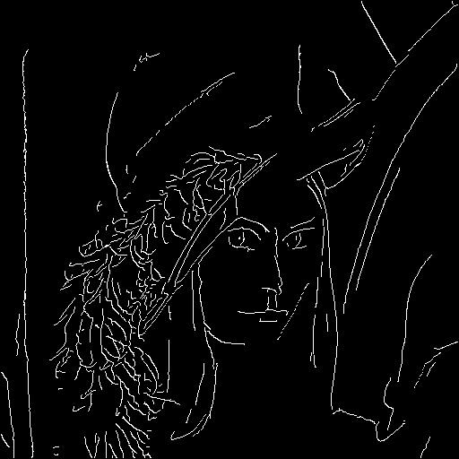

# Canny Edge Detection Implementation

本專案使用 Python 與 NumPy 從零實作 Canny 邊緣檢測演算法。

與直接呼叫 `cv2.Canny` 等現成函式不同，本專案旨在展示對影像處理底層演算法的理解，完整實作了 Canny 演算法的五個關鍵步驟：高斯模糊、梯度計算、非極大值抑制、雙閾值篩選（結合 Otsu 自動閾值）以及邊緣連接。

## 執行結果 (Results)

執行程式後，將會生成各階段的處理影像。以下展示原始輸入與最終邊緣檢測的對比：

| 原始影像 (Original) | 邊緣檢測結果 (Edge Detected) |
| :---: | :---: |
|  |  |

## 專案特色 (Features)

本實作包含以下演算法細節，並針對雜訊處理與邊緣連續性進行了優化：

1.  **高斯濾波 (Gaussian Filter)**
    * **目的**：平滑影像，去除高頻雜訊，避免雜訊被誤判為邊緣。
    * **實作**：產生 5x5、Sigma=1.4 的高斯核並進行卷積運算。

2.  **梯度計算 (Sobel Filters)**
    * **目的**：偵測影像中亮度變化劇烈的區域。
    * **實作**：使用 Sobel 算子分別計算水平與垂直方向的梯度，並據此計算梯度強度與梯度方向。

3.  **非極大值抑制 (Non-Maximum Suppression, NMS)**
    * **目的**：將粗糙的邊緣變細，確保邊緣只有一個像素寬。
    * **實作**：將梯度方向量化為四個角度 (0, 45, 90, 135 度)，並比較當前像素與梯度方向上鄰近像素的大小，僅保留局部最大值。

4.  **雙閾值 (Double Threshold) 與 Otsu 自動閾值**
    * **目的**：區分「強邊緣」、「弱邊緣」與「非邊緣」。
    * **實作**：
        * 實作 **Otsu's Method** 自動計算最佳的高閾值 (High Threshold)，使演算法能適應不同對比度的圖片。
        * 低閾值 (Low Threshold) 設定為高閾值的 0.5 倍。

5.  **邊緣連接 (Edge Linking)**
    * **目的**：連接斷裂的邊緣，並過濾掉孤立的雜訊。
    * **實作**：利用 **深度優先搜尋 (DFS)** 演算法，從所有「強邊緣」點出發，追蹤並保留與其相連的「弱邊緣」點，其餘未連接的弱邊緣則視為雜訊濾除。

## 程式碼結構摘要 (Code Structure)

本專案的主要函式與其對應功能如下：

* `gaussian_kernel(size, sigma)`: 產生指定尺寸與標準差的高斯濾波器。
* `sobel_filters(img)`: 計算影像的梯度強度與梯度方向。
* `non_max_suppression(img, D)`: 執行非極大值抑制，細化邊緣。
* `get_otsu_threshold(image)`: 計算 Otsu 閾值，用於動態決定雙閾值的門檻。
* `double_threshold(img, low, high)`: 根據閾值將像素分為強邊緣、弱邊緣與背景。
* `edge_linking(img, weak, strong)`: 使用 Stack 實作 DFS 演算法，連接並保留有效的邊緣。

## 輸出檔案說明 (Output Files)

程式執行過程中會依序輸出各階段影像，方便分析演算法效果：

* `1_canny_noisy_input.jpg`: 加入高斯雜訊後的模擬輸入圖。
* `2_canny_gaussian_kernel.jpg`: 經過高斯模糊降噪後的影像。
* `3_canny_sobel_gradient.jpg`: 計算出的梯度強度影像。
* `4_canny_nms.jpg`: 經過非極大值抑制後的細化邊緣影像。
* `5_canny_threshold.jpg`: 雙閾值分類後的影像（包含強弱邊緣）。
* `6_canny_final.jpg`: 經過邊緣連接後的最終結果。

## 環境需求 (Requirements)

本專案依賴以下 Python 套件：

* `numpy`: 矩陣運算與演算法實作
* `opencv-python` (cv2): 僅用於讀取/儲存圖片與顯示，**核心算法皆為自行實作**
* `matplotlib`: (選用) 用於其他視覺化需求

安裝指令：

```bash
pip install numpy opencv-python matplotlib
