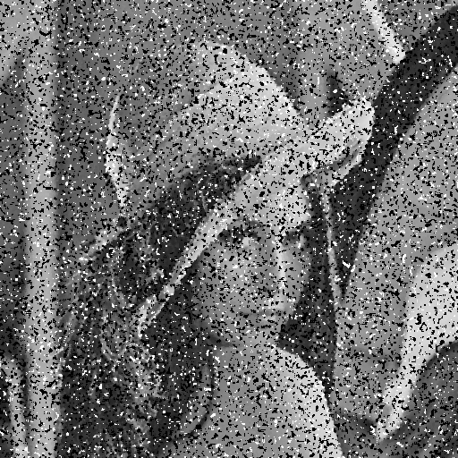

# Denoise — 中值濾波與自適應中值濾波

本模組示範影像去雜訊的流程，特別展示如何**手動添加椒鹽雜訊（Salt & Pepper Noise）**，  
並分別使用 **Median Filter（中值濾波）** 與 **Adaptive Median Filter（自適應中值濾波）** 進行修復比較。  

所有濾波過程皆以 **NumPy** 手刻實作完成，未使用 OpenCV 的現成濾波函式。

---

## 方法簡介

- **Median Filter（中值濾波）**：  
  採用固定視窗大小，對每個像素以視窗內的中位數取代，可有效抑制椒鹽雜訊。  

- **Adaptive Median Filter（自適應中值濾波）**：  
  從小視窗開始，若中值能區分雜訊與訊號則直接使用，否則逐步擴大視窗直到上限。  
  此方法在高雜訊情況下仍能保留影像邊緣與細節。

> 本資料夾的 `main.py` 會自動載入影像、添加雜訊、執行兩種濾波並輸出結果影像。

---

## 處理流程

1. **原始影像載入**  
   以灰階模式讀取測試影像，並於影像中手動嵌入文字「CSE」與「NCHU」，  
   用以測試濾波演算法在細節與邊緣區域的保留效果。

2. **添加椒鹽雜訊**  
   隨機挑選像素並修改亮度：  
   - 約 **1/3 的像素設為 0（黑色）**  
   - 約 **1/4 的像素設為 255（白色）**  
   其餘像素保持原狀，以避免出現規律性圖樣，使雜訊分布更接近真實情況。  
   新影像儲存為 `noise_lena_black_with_CSE.png`。

3. **中值濾波 (Median Filter)**  
   使用固定大小的視窗（例如 3×3 或 5×5），  
   以鄰域中位數取代像素值，有效去除大部分椒鹽雜訊。  
   結果儲存為 `median_filter_noise_lena_black_with_CSE.png`。

4. **自適應中值濾波 (Adaptive Median Filter)**  
   演算法流程如下（視窗大小為 `S`，最大為 `S_max`）：
   - **A 階段**：若 `min < med < max`，表示中值非雜訊 → 進入 B 階段；否則擴大視窗。  
   - **B 階段**：若 `min < pixel < max`，保留原像素；否則以中值取代。  
   從 3×3 開始逐步擴展，最多至 7×7。  
   此方法在雜訊密度高的區域仍能穩定工作。  
   結果儲存為 `adaptive_median_filter_noise_lena_black_with_CSE.png`。

---

## 結果比較

| 原始影像（含 CSE / NCHU） | 添加椒鹽雜訊後 | 中值濾波結果 | 自適應中值濾波結果 |
|:----------------:|:----------------:|:----------------:|:----------------:|
|  |  |  |  |

---
