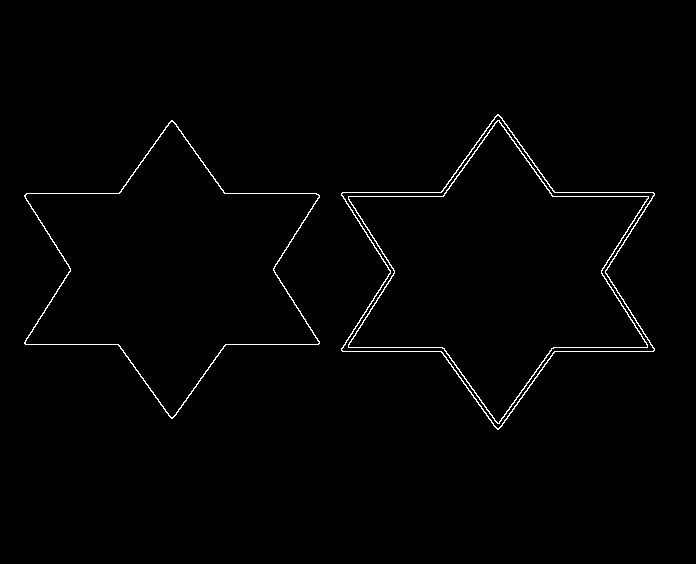

# Edge Detection — 形態學邊緣偵測與填補示例

本資料夾示範以**形態學 (Mathematical Morphology)** 操作進行邊緣偵測與區域填補的流程，核心包含 **Erosion（侵蝕）** 與 **Dilation（擴張）**，並提供「找邊界」與「區域填補」兩個實例。

---

## 形態學基礎

### 1) Erosion（侵蝕）

* **概念**：用結構元素（Structuring Element, SE）在影像上滑動，若 SE 覆蓋範圍內的像素無法完全「落在」前景，中心像素就被移除（變成 0）。
* **效果**：前景收縮、孔洞變大、細小雜點被消除；邊界會向內縮。
* **用途**：去除小顆粒雜訊、分離相連物件（搭配閾值化結果）。

### 2) Dilation（擴張）

* **概念**：用 SE 在影像上滑動，若 SE 與前景有重疊，中心像素就被加入（變成 1）。
* **效果**：前景膨脹、細縫被填補、邊界向外擴張。
* **用途**：連接破碎邊緣、填補狹窄間隙或小孔洞。

> **Erosion 與 Dilation 的組合**能構成多種經典操作（Opening/Closing、Gradient、Boundary Extraction、Hole Filling…），本範例重點展示「邊界擷取」與「填補」。

---

## 邊界擷取 (Boundary Extraction) 範例

邏輯上可用：

* 二值影像 `A` 的邊界 ≈ `A - Erode(A)`（或 `Dilate(A) - A` 亦可視情況使用）

下圖為本資料夾中的範例結果（`extract.png`），展示侵蝕後做差分所取得的邊界：

---

## 區域填補 (Region Filling) 範例

典型流程（基於 seed 的區域成長 + 形態學約束）：

1. 準備**種子點** `X0`（位於要填補的洞內）。
2. 反向遮罩 `~A`（只允許在背景內擴散）。
3. 迭代：(X_{k+1} = (\text{Dilate}(X_k) \land \sim A))，直到收斂。
4. 最終 `X` 與 `A` 合成得到填補結果。

下方為動畫示例（`filling_animation.gif`），可視覺化看到種子區域如何逐步擴張直至收斂：

---

##
